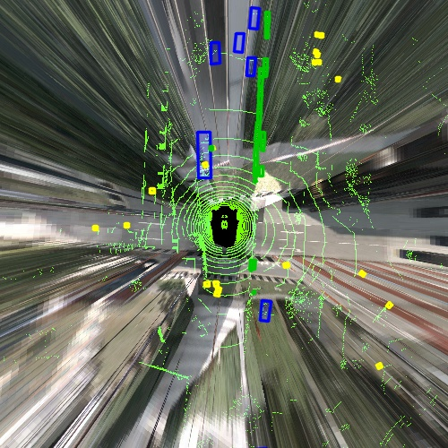

# 🚀 High-Performance Multi-Modal BEV Fusion

> A production-grade BEV (Bird's-Eye View) transformation engine for autonomous driving data pipelines.

## 🌟 Key Achievements
- **Spatial Fusion**: Aligned 6-camera surround views with 3D LiDAR point clouds and Ground Truth boxes.
- **Latency Optimization**: Successfully broke the **IO-bound** bottleneck using `TurboJPEG` hardware-accelerated decoding.
- **Zero-Copy Architecture**: Utilized `SharedMemory` and `Numba JIT` for high-speed cross-process data flow.

## 📊 Performance Benchmark (End-to-End)

| Mode | FPS | Avg Latency | IO Share | Optimization |
| :--- | :--- | :--- | :--- | :--- |
| **Baseline** | 0.85 | 1171ms | 65% | Single-process pure python |
| **Production**| **2.08** | **480ms** | **33%** | **LUT + Numba + SharedMemory + TurboJPEG** |

**🚀 Total Speedup: +144%**

## 🖼️ Visual Result

  
  
<i>Fused BEV Output: LiDAR point clouds (heatmapped) + Surround Cameras + 3D Bounding Boxes</i>

